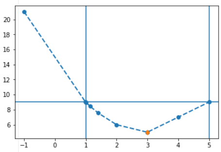

.. likelihoodprofiler documentation master file, created by
   sphinx-quickstart on Sat Aug 24 18:33:26 2019.
   You can adapt this file completely to your liking, but it should at least
   contain the root `toctree` directive.

Welcome to likelihoodprofiler's documentation!
==============================================

.. toctree::
   :maxdepth: 5
   :caption: Contents:

Indices and tables
==================

* :ref:`genindex`
* :ref:`modindex`
* :ref:`search`

Installation
=============
Description for installation

Quick start
=============
For plot simple get interval::

  from likelihoodprofiler import get_interval
  f_3p_1im_dep = lambda x: 5.0 + (x[0]-3.0)**2 + (x[0]-x[1]-1.0)**2 + 0*x[2]**2
  res0 = get_interval(
      [3., 2., 2.1],
      0,
      lambda x: f_3p_1im_dep(x),
      "LIN_EXTRAPOL",
      loss_crit = 9)
  res0.plot()

Intro
======
The reliability and predictability of a kinetic systems biology (SB) and systems pharmacology (SP) model depends on the calibration of model parameters. Taking into account the lacking of data and the experimental variability the value of any parameter determined unambiguously. This results in characterization of parameter by "confidence intervals" or even "non-identifiable" parameters when the confidence interval is open. The package includes algorithms to perform practical identifiability analysis and evaluation confidence intervals using Profile Likelihood [2] which can be applied to complex SB/SP models. Results of the identifiability analysis can be used to qualify and calibrate parameters or to reduce the model.

Objective
=========
The package introduces several original algorithms taking into account the following points:

* This algorithm does not assume that the likelihood function is differentiable at any point. This allows using derivation free and global methods of optimization which do not require the calculation of gradients.
* The calculation of likelihood function is the most computationally expensive operation within the others. It becomes critical for large dynamic model used nowadays in systems biology.
* The algorithm should calculate the confidence endpoint with the selected tolerance and must be optimal regarding likelihood function calls. The intermediate (non-endpoint) profile points is not important.
* The algorithm should be stable for calculation both finite and infinite intervals. They should stop immediately (with the corresponding status) if parameter is not identifiable.

Methods overview
================
This algorithms can be applied to complex kinetic models where function differentiability is not guaranteed and each likelihood estimation is computationally expensive.

The package introduces original "one-pass" algorithm: **Confidence Intervals evaluation by Constrained Optimization** 6 developed by the authors of this package. CICO_ONE_PASS utilizes the **Inequality-based Constrained Optimization** [3-4] for efficient determination of confidence intervals and detection of “non-identifiable” parameters.

The "multi-pass" methods use extrapolation/interpolation of likelihood points to the critical level: linear (LIN_EXTRAPOL) and quadratic (QUADR_EXTRAPOL) approaches. They are also effective for both identifiable and non-identifiable parameters.

References
==========
  1. Wikipedia Identifiability_analysis
  2. Kreutz C., et al. Profile Likelihood in Systems Biology. FEBS Journal 280(11), 2564-2571, 2013
  3. Steven G. Johnson, The NLopt nonlinear-optimization package, link
  4. Andrew R. Conn, Nicholas I. M. Gould, and Philippe L. Toint, "A globally convergent augmented Lagrangian algorithm for optimization with general constraints and simple bounds," SIAM J. Numer. Anal. vol. 28, no. 2, p. 545-572 (1991)
  5. Julia: A Fresh Approach to Numerical Computing. Jeff Bezanson, Alan Edelman, Stefan Karpinski and Viral B. Shah (2017) SIAM Review, 59: 65–98
  6. Borisov I., Metelkin E. An Algorithm for Practical Identifiability Analysis and Confidence Intervals Evaluation Based on Constrained Optimization. 2018. October. ICSB2018. https://doi.org/10.13140/RG.2.2.18935.06563
